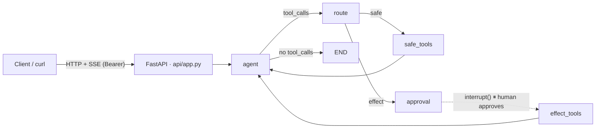

# lang_ai_agent

**A LangGraph agent backend built around production patterns**: a streaming HTTP API, durable state that survives restarts, a human-approval gate for side-effecting tools, deterministic tests that never call a real LLM, and built-in observability.

It ships as an **Ops Copilot** demo (multi-store retail: "what's about to stock out?" → "send the reorder email"), but the runtime is domain-agnostic — the tools are the only retail-specific part. Swap them (or plug in your own MCP servers) and keep everything else.

> **Status** — the v0.1 backend is complete and gated by `make check` (ruff, pyright strict, pytest; 100% coverage on the graph core). PyPI packaging and the first release are next. Internal design docs under `docs/` are in Korean; this README is the English entry point.

## How it works

The agent calls **read-only tools** freely. Any **side-effecting tool** stops the graph at a LangGraph `interrupt()` and waits for a human to approve or reject it over the API. The graph is checkpointed at that point, so the server can restart in between. A rejection with a comment goes back to the model, which revises its draft and asks again.



The only edge into `effect_tools` passes through `approval`. That is not a convention — a test walks the compiled graph and fails if any other path appears.

## Quickstart

Requires Python 3.12+ and [uv](https://docs.astral.sh/uv/).

```bash
uv sync                      # (pip install lang-ai-agent — after the PyPI release)
uv run lang-ai-agent init    # pick a provider, paste your API key → writes .env (mode 0600)
uv run lang-ai-agent serve   # http://127.0.0.1:8000 — fails fast if the key is missing
```

`init` supports **Anthropic** (default), **OpenAI**, **xAI** and **Google**; `MODEL` uses LangChain's `provider:model` form, so any other provider `init_chat_model` supports works as well. Your key is written only to the git-ignored `.env`.

Talk to it from another terminal (`TOKEN` is the `APP_BEARER_TOKEN` that `init` printed):

```bash
H=(-H "Authorization: Bearer $TOKEN" -H 'content-type: application/json')
TID=$(curl -s -X POST "${H[@]}" localhost:8000/threads | jq -r .thread_id)
curl -sN -X POST "${H[@]}" localhost:8000/threads/$TID/messages \
  -d '{"content":"Which items at store main will stock out next week? Summarize as a table."}'
```

The response is a Server-Sent Events stream: `tool_start`/`tool_end` for `check_stockout`, `token` events carrying the table, then `usage` and `done`.

## API

| Method · path | Body | What it does |
|---|---|---|
| `POST /threads` | — | Issue a `thread_id` |
| `POST /threads/{id}/messages` | `{content}` | Run the graph; **SSE stream** |
| `GET /threads/{id}/state` | — | `last_message`, `pending` action, `usage`, `awaiting_approval` |
| `POST /threads/{id}/approve` | `{approved, comment?}` | Resume from the interrupt; **SSE stream** |

SSE events (Pydantic-typed, discriminated on `type`): `token` · `tool_start` · `tool_end` · `interrupt` (pending action + draft) · `usage` · `done` · `error`. A stream ends with either one `interrupt` or `usage` → `done`.

## 60-second demo

1. `lang-ai-agent serve` — one JSON log line, server up.
2. Ask what will stock out at store `main` → tool call, streamed table.
3. "Send the reorder email for the at-risk items" → suggestions are fetched, a draft is written, and the stream stops at **`interrupt`** showing the recipient and draft.
4. `GET /state` → `awaiting_approval: true`.
5. `POST /approve {"approved": true}` → the email tool runs (dry-run by default), the agent reports back, `usage` → `done`.

The full script with timings and a restart-resilience variant is in `docs/DEMO.md`.

## Real-model smoke

```bash
uv run lang-ai-agent init         # once — your key goes to .env only
make smoke                        # scenario 1 (query) + scenario 2 (draft → y/n approval in the console)
uv run lang-ai-agent smoke --mcp  # same, with the real MCP servers from mcp_servers.json
```

The smoke always runs dry-run, whatever `.env` says, and costs three to four model calls (cents on a Sonnet-class model). Everything else runs without a key: `make check` makes zero network calls.

## Why it is built this way

- **Approval as topology, not a flag.** Side-effecting tools are reachable only through the `approval` node, and a graph-structure test enforces it. Sending is double-gated: the interrupt *and* `SEND_MODE=live`.
- **The model is a script in tests.** `ScriptedChatModel` replays a fixed sequence of `AIMessage`s (tool calls included) and fails loudly if the script is exhausted or diverges. With the model scripted, the graph is a state machine and every path — approve, reject-and-revise, tool failure, restart mid-interrupt — is a deterministic test. Real models appear only in the smoke.
- **State stays small.** State is serialized at every checkpoint, so it holds messages and minimal metadata; large tool results are summarized before they enter it.
- **Static types as the cheapest feedback loop.** pyright strict + Pydantic v2 at every boundary (requests, model output, MCP responses), no `Any` returns, and every `# type: ignore` carries a reason.
- **Fail at startup, not on the first request.** A missing provider key or bearer token is a `ConfigError` with the fix in the message, raised before the server binds.
- **Provider-agnostic, MCP-native.** `init_chat_model` for the model; `langchain-mcp-adapters` to mount MCP servers as tools, each mapped to safe/effect (unlisted tools default to *effect*).

## Development

```bash
make check        # ruff check + pyright strict + pytest (core coverage gate ≥ 90%)
make dev          # uvicorn with --reload
```

```
src/lang_ai_agent/
  core/       state.py (AgentState, PendingAction, Usage) · graph.py (StateGraph) · tools_spec.py (safe/effect)
  adapters/   llm.py (providers) · checkpoint.py (AsyncSqliteSaver) · mcp_loader.py · effects.py · observability.py
  api/        app.py (FastAPI assembly) · sse.py (event schema + mapper) · auth.py
  cli.py      init · serve · smoke        smoke.py   real-model smoke logic
tests/        helpers (ScriptedChatModel, MockEffects, FixedClock) · unit · component · e2e (API-level scenarios)
```

CI runs `make check` on every push and pull request (`.github/workflows/ci.yml`).

## Docs (Korean)

| Doc | Contents |
|---|---|
| `CLAUDE.md` | Agent steering: stack, commands, conventions, guardrails |
| `docs/SPEC.md` | Product spec: goals, non-goals, scenarios, roadmap |
| `docs/DESIGN.md` | Technical design: graph, state, API, tool classes, MCP, env, onboarding, packaging |
| `docs/TESTING.md` | Test strategy: scripted model, golden trajectories, edge-case checklist |
| `docs/TASKS.md` | Task backlog with machine-checkable completion criteria |
| `docs/WORKFLOW.md` | AI-native development rules for this repo |
| `docs/DEMO.md` | The 60-second demo script |

This repo is developed doc-first: spec and design are updated before code, implementation is done task-by-task by Claude Code, and `make check` is the shared gate.

## Roadmap

- **v0.1** — single-agent graph + approval gate + FastAPI SSE + deterministic tests + onboarding CLI + CI + PyPI release
- **v0.2** — PostgresSaver, supervisor multi-agent, always-on MCP server connections
- **v0.3** — evaluation harness (golden-trajectory regression + eval sets), cost reports, Docker template

## License

To be finalized with the first release.
